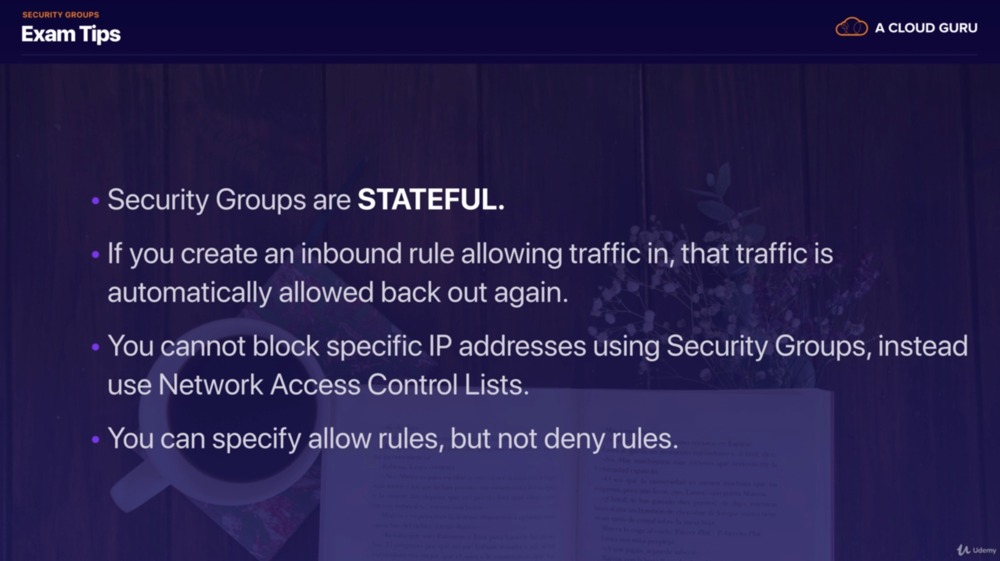

# Table of Content
### Azure 
1. [Azure AZ-304 Solution Architect & System Design Materials](https://github.com/Glareone/AZ-304-SA-And-Architecture-Design-In-Depth)
## AWS Theory. AWS Solution Architect Materials to pass the exam
1. [AWS. Interesting Materials](#interesting-materials)
2. [AWS. General Information](#section-3-general-information-about-aws-services)
3. [AWS. EC2](#section-4-ec2)
4. [AWS. Databases](#section-5-databases-on-aws)
5. [AWS. Route 53.DNS101. Route Policies](#section-6-route53-dns101-routing-policies-tips)
6. [AWS. VPC](#section-7-vpc-custom-vpc-configuration)
7. [AWS. HA & Load Balancing](#section-8-high-availability-architecture-load-balancing-target-groups-cloudformation-beanstalk)
8. [AWS. Apps: SQS, SNS, Kinesis, Transcoder, Cognito, Web Identify Federation](#section-9-applications-sqs-sns-swf-kinesis-elastic-transcoder-cognito---web-identify-federation)
9. Migration To AWS, articles:  
  a. https://docs.aws.amazon.com/prescriptive-guidance/latest/large-migration-governance-playbook/welcome.html  
  b. https://www.projectpro.io/article/aws-cloud-migration-project-plan-example/753#:~:text=AWS%20Cloud%20migration%20project%20plan%20helps%20you%20identify%20your%20goals,the%20business%20requirements%20and%20goals.  

## AWS In Practice.
1. [AWS Solution Architecture In Practice](https://github.com/Glareone/AWS-Certified-Solution-Architect/blob/master/AWS-Architecture-In-Practice/Readme.md)  
  a. [Step Function. Advantages & Disadvantages. Comparison. Alternatives.](https://github.com/Glareone/AWS-Certified-Solution-Architect/blob/master/AWS-Architecture-In-Practice/StepFunction.md)  
  b. [SQS + Lambda. Fan-out. Event-Storming as you services strategy.](https://github.com/Glareone/AWS-Certified-Solution-Architect/blob/master/AWS-Architecture-In-Practice/SQSParallelProcessing.md)   
  c. [WIP...KPI and Logs. Principles of splitting the data. Telemetry vs Logs vs Metrics.](https://github.com/Glareone/AWS-Certified-Solution-Architect/blob/master/AWS-Architecture-In-Practice/KpiAndLogs.md)  
  d. [WIP...SignalR in AWS Serverles.](https://github.com/Glareone/AWS-Certified-Solution-Architect/blob/master/AWS-Architecture-In-Practice/WebSocketsAndSignalR.md)  

## Interesting materials
[Deploy react-app to S3 or CloudFront](https://wolovim.medium.com/deploying-create-react-app-to-s3-or-cloudfront-48dae4ce0af)

# AWS CERTIFIED SOLUTION ARCHITECT MATERIALS

Exams and their levels

Schemes:

Section 1: Basis

Schemes:

Section 3: General Information about AWS services.
===

Section3: IAM

Section3: S3 Storage Information

.png)

Section3: S3 Encryption

.png)
,client.png)

Section3: S3 Versioning

Section3: S3 Lifecycle management

You could move your data between storage types: From Standard to Glacier, for example.

Section3: S3 Cross-Region Replication

[AWS Replication Info](https://docs.aws.amazon.com/AmazonS3/latest/dev/replication.html)

Replication enables automatic, asynchronous copying of objects across Amazon S3 buckets. 

Buckets that are configured for object replication can be owned by the same AWS account or by different accounts. 
You can copy objects between different AWS Regions or within the same Region.

Section3: S3 Transfer Acceleration

Section3: CloudFront

Invalidating Files:
If you need to remove a file from CloudFront edge caches before it expires, you can do one of the following:
Invalidate the file from edge caches. The next time a viewer requests the file, CloudFront returns to the origin to fetch the latest version of the file.
Use file versioning to serve a different version of the file that has a different name. For more information, see Updating Existing Files Using Versioned File Names.

Important:
You cannot invalidate objects that are served by an RTMP distribution.
To invalidate files, you can specify either the path for individual files or a path that ends with the * wildcard, which might apply to one file or to many, as shown in the following examples:
/images/image1.jpg

/images/image*

/images/*

Section3: Snowball

Section3: Storage Gateway - Basis

Section3: File Gateway

Section3: Volume Gateways

Stored Volumes:

Cached Volumes:

Tape Gateway:

Section3: S3 Exam tips

* SAML: [Security Assertion Markup Language 2.0](https://aws.amazon.com/identity/saml/) -  
is an open standard for exchanging identity and security information with applications and service providers.

Section 4: EC2
===

Section4: EC2 Basis

Section4: Lab, tips

To create SSH public key for EC2 you need to run next command in command line:
ssh-keygen -y -f Glareone-EC2-Lab1-Key-Pair.pem > MyKP.pub
"Glareone-EC2-Lab1-Key-Pair.pem" - key pair file from console.

* To resolve problem with permissions on this key:
[windows-ssh-permissions-for-private-key](https://superuser.com/questions/1296024/windows-ssh-permissions-for-private-key-are-too-open)

To run SSH commands you could use "Secure Shell App" Chrome extension.
to come into your machine you have to use its ip-address (IPv4 Public IP in Instances: [EC2-instances](https://console.aws.amazon.com/ec2/home?region=us-east-1#Instances:sort=instanceId))
* our: 54.84.6.245
* user - ec2-user

on machine: 
* yum update -y (update all packages on your machine)
* yum install httpd -y (install httpd)

[root@ip-172-31-82-192 html]# cd var/www/html
[root@ip-172-31-82-192 html]# nano index.html (create index.html in nano, just create a very simple html doc)
[root@ip-172-31-82-192 html]# service httpd start (start httpd server)
[root@ip-172-31-82-192 html]# chkconfig on (rerun httpd server if our server rebooted accidentally)

check how it works: just copy address to your browser.

Section4: EC2 - How to move Volume between zones OR regions

Section4: EC2 - Lab2 - Security(ports) & Disk Encryption

Section4: EC2 Exam tips

Security (ports) & Disk Encryption:

Section4: EC2 Volumes & Snapshots Exam Tips

Section4: EC2 : EBS (Block Store) vs Instance Store

Major Difference - Instance Store is a real disk which is more closer to CPU.
in heavy load on read\write you could drastically decrease CPU waiting time.

But Instance Store (root volume at least) is not been saved if something wrong with Hypervisor will occur.

Section4: CloudWatch and CloudTrail

Section4: AWS Command Line + Exam Tips

Safe information - this user is deleted.

Section4: AWS EC2 Role vs Users AccessKey + SecretKey

1) You could create a new role in IAM -> Create Role (For EC2).
There you could select policies for your new role. Administrator Access is suitable to manage EC2.

2) Then - you have to attach new role to your instance.
* When you login to server using ssh it will check do you have enough permissions to work with it or not.
It is more safe than use AccessKey + SecretKey pair because this pair is stored in secret directory:
~/.aws (under the root). 
* If you delete it - you will not continue your work. Besides, your credentials could be stolen
by hacker. That's why role usage is a better way.

Section4: EC2 Instance Metadata and Exam Tips:

a) from aws console after ssh logging:
* [root@ip-172-31-22-213 ec2-user]# curl http://172.31.22.213/latest/user-data
You will see your bootstrap script (which you could add as listed below)

script example:
[bootstrap script example](files/BootStrap-script.txt)

b) from aws console after ssh logging:
* [root@ip-172-31-22-213 ec2-user]# curl http://172.31.22.213/latest/meta-data
get whole bunch of options:

Section4: Elastic File System

This filesystem is better than EBS because you could increase its volume in a second.
Also, you could share files between your EC2 instances.
If you update a file from one instance - you could read changes from another instantly.

* To work with it you need to add the next port to your security group:
NFS - port 2049

Section4: EC2 - Placement Groups

* PAY ATTENTION! Spread Placement Group can only have 7 running instances per Availability Zone.

* Advantages and Exam tips:

Section4: Interesting Exam Questions

1 Can I move a reserved instance from one region to another?
* No. Depending on you type of RL you can You can modify the AZ, scope, network platform, or instance size 
(within the same instance type), but not Region. In some circumstances you can sell RIs, but only if you have 
a US bank account.

2 You need to know both the private IP address and public IP address of your EC2 instance. You should
* Retrieve meta-data : /latest/meta-data

3 If an Amazon EBS volume is an additional partition (not the root volume), can I detach it without stopping the instance?
* Yes. although it may take some time.

4. You can add multiple volumes to an EC2 instance and then create your own RAID 5/RAID 10/RAID 0 configurations using 
those volumes.
* true

5. Individual instances are provisioned 
* In AZ

6. Spread Placement Groups can be deployed across multiple Availability Zones
* True

7. To retrieve instance metadata or user data you will need to use the following IP Address:
* http://169.254.169.254

8. Will an Amazon EBS root volume persist independently from the life of the terminated EC2 instance to which it was 
previously attached? In other words, if I terminated an EC2 instance, would that EBS root volume persist?
* Only if I specify that it should do so. You can control whether an EBS root volume is deleted when its associated 
instance is terminated. The default delete-on-termination behaviour depends on whether the volume is a root volume, 
or an additional volume. By default, the DeleteOnTermination attribute for root volumes is set to 'true.' However, 
this attribute may be changed at launch by using either the AWS Console or the command line. For an instance that 
is already running, the DeleteOnTermination attribute must be changed using the CLI.

9. Can you attach an EBS volume to more than one EC2 instance at the same time?
* No.

10. I can use the AWS Console to add a role to an EC2 instance after that instance has been created and powered-up.
* True

11. Can you attach an EBS volume to more than one EC2 instance at the same time?
* No.

Section 5: Databases On AWS
===

Section 5: Relational & NoSQL Databases

The most important features:

One of two ways to improve performance - use "Read Replica":
[aws link](https://aws.amazon.com/rds/details/read-replicas/)

Database processing types, OLTP vs OLAP:
OLTP for Relational Databases (RDS), OLAP for Warehouses (Redshift)

Caching:

Exam Tips:

Section 5: RDS: Relational Database, general 

Issue solving with old AWS RDS interface: [Link](https://help.acloud.guru/hc/en-us/articles/360001078435)

Section 5: RDS: Read Replicas, Backups, Multi-AZ. Lecture 

FOR DATA RESTORATION:

FOR PERFORMANCE IMPROVEMENTS:

Detailed Explanation How to add Read Replica to DB instance:

Section 5: NoSQL Databases. DynamoDB 

Section 5: Redshift. Database Warehousing 

Section 5: MySQL - Aurora 

Section 5: ElastiCache. Redis and Memcached 

Section 5: Db Lectures Summary and Exam Tips 

Section 6: ROUTE53, DNS101, Routing Policies, Tips
===

Section 6: DNS101 & Route53

Section 6: Route53, Routing Policies

Routing Types:

.jpg)

Section 6: Additional Exam Tips

Section 7: VPC, Custom VPC, Configuration
===

Section 7: VPC General Information and Exam Tip

.jpg)

Section 7: Custom VPC Configuration

Then we could start creating our EC2 instances.
In Private EC2 Instance we could create our Database (for example). 
This EC2 instance shouldn't have direct public access due potential security issues.

To create SSH access to private EC2 instance though public EC2 - we have to use Private EC2 IP address and make some changes:
 

Section 7: NAT in VPC

Network address translation (NAT) is a method of remapping one IP address space into another by modifying
 network address information in the IP header of packets while they are in transit across a traffic routing device.
 
Difference between NAT Gateway and NAT Instance:
1) NAT Instance is literally a single EC2 Instance which do this job.
2) NAT Gateway is highly available gateway which allows you to have your private subnets and communicate out 
to the internet without becoming public.

1:

Additional information could be found here: [AWS Documentation Link](https://docs.aws.amazon.com/vpc/latest/userguide/VPC_NAT_Instance.html)
Important Note in documentation! :
You must disable Source/Destination traffic checks.
To Do that:

The problem with this approach is in NAT EC2 Instance. Later This EC2 Instance with NAT would be a massive bottleneck.
And, of course, it's a point of failure.

2: Another approach is create a NAT Gateway.

Section 7: Access Control List (ACL) in VPC

Pay Attention on Ephemeral Port usage in outbound rules:
On servers, ephemeral ports may also be used as the port assignment on the server end of a communication. This is
done to continue communications with a client that initially connected to one of the server's well-known service 
listening ports.

We really need them for FTP, SSH, Http sessions and so on (and because NAT gateway uses them as well).
More information: [Ephemeral Port](https://en.wikipedia.org/wiki/Ephemeral_port)
About Ephemeral port ranges for AWS: 
[Ephemeral Port Ranges](https://docs.aws.amazon.com/vpc/latest/userguide/vpc-network-acls.html)

Exam tips:

Section 7: Elastic Load Balancing, VERY QUICK TIPS

Section 7: VPC Flow Logs

Exam tips:

Section 7: Bastion

Bastion is EC2 which allows you safety access to another EC2 instances using SSH or RDP.
[Bastion Link](https://aws.amazon.com/blogs/security/controlling-network-access-to-ec2-instances-using-a-bastion-server/)

Section 7: Direct Connection

Section 7: VPC Endpoints

Two types of Endpoints:
Interface and Gateway.

<b>1. Interface:</b>

<b>2. Gateway:</b>

<b>Incorrect way:</b>

<b>Correct:</b>

How to do that:
1. Create a role to get full access to S3 Bucket.

2. Attach newly created "S3 admin role to EC2":

3. Check out the ACL Table. We should be confident that we don't have any restrictions to communicate with other services.
You could do that in VPC menu, Access Control List configuration / attach default ACL to our private subnet.

4*. Using S3 address - make manipulation with data on S3.
S3 address example is: <b>s3://YOUR_BUCKET_NAME</b>
It will work using NAT Gateway and Route in Route table:

It won't work without internet and connection to NAT Gateway.
That's why we need to configure our Endpoint.

5. Make Virtual Endpoint to get access to S3 Bucket without using NAT Gateway.

Section 7: VPC Summary

Security Groups Additional info: [Link](https://docs.aws.amazon.com/AWSEC2/latest/UserGuide/ec2-security-groups.html)
To Check IP-addresses and masks: [CIDR.XYZ](https://cidr.xyz/)

Security Group Rules:
* The rules of a security group control the inbound traffic that's allowed to reach the instances that are associated with the security group and the outbound traffic that's allowed to leave them.
* The following are the characteristics of security group rules:
* By default, security groups allow all outbound traffic.
* Security group rules are always permissive; you can't create rules that deny access.
* Security groups are stateful — if you send a request from your instance, the response traffic for that request is allowed to flow in regardless of inbound security group rules. 
* For VPC security groups, this also means that responses to allowed inbound traffic are allowed to flow out, regardless of outbound rules. For more information, see Connection Tracking.
* You can add and remove rules at any time. Your changes are automatically applied to the instances associated with the security group.

Section 8: High-Availability Architecture, Load Balancing, Target Groups, CloudFormation, BeansTalk
===

Section 8: Elastic Load Balancing + Target Groups

Official documentation: 
[ELB Documentation](https://docs.aws.amazon.com/elasticloadbalancing/latest/userguide/what-is-load-balancing.html)

Load Balancer and Health Check diagram:
[ELB_Diagram](/files/Load_Balancer&Health_Check_Diagram.pdf)

Registered Instances for Your Classic Load Balancer: 
[link](https://docs.aws.amazon.com/elasticloadbalancing/latest/classic/elb-backend-instances.html)

<b>Lab Tips:</b>

Bootstrap script: [link](files/ELB_Lab_1_bootstrap_script.txt)

We have to launch 2 EC2 instances in default VPC, but in different AZ Zones.

Tags: Name - Web01 and Web02
Security Group - WebDMZ

Keep in mind that adding Elastic Load Balancer moves you out of free-tier (or barely free-tier)

<b>ADVANCED LOAD BALANCING PART:</b>

Section 8: Launch Configurations, Auto Scaling Groups

Description: an Auto Scaling Group contains a collection of Amazon EC2 instances that are treated as a logical grouping
for the purposes of automatic scaling and management.
[link](https://docs.aws.amazon.com/autoscaling/ec2/userguide/AutoScalingGroup.html)

Section 8: HA Architecture

A lot of questions based on High Availability design.

Section 8: HA Architecture, Lab

We need to build the next:

#####1 step - we have to build our S3_buckets:

#####2 Security Groups for buckets and MySQL RDS storage:

#####3 step - CloudFront:

#####4 step - RDS:

#####5 step - IAM and Security Groups:

#####6 step - provisioning our EC2 instance:

Bootstrap file: [file](files/HA_Architecture_bootstrap_for_EC2.sh)

Wait while CloudFront and RDS instance are ready to move further.

#####7 step - WordPress configuration:

You must deploy wp-config.php file manually from ssh console if it can't do that automatically under your
security group policies (but we opened 3306 port for this purposes)

#####8 - create our post on wordpress with pictures and check where they store. They will be right in EC2:
We need to move them to S3 and use our CloudFront to store and distribute them faster.

* Copy media files from directory to media S3 bucket:
Command from SSH to copy media files to S3:

* Copy all files to code S3 bucket:

* then we need to move our storage to S3s.
We have to modify ".htaccess" file, here we will find our rewrite rule. 
Default configuration:

We have to paste our CloudFront domain name.

And Paste here:

Sync htaccess changes with S3-code-bucket:

* to move all next changes right to S3 we have to manage our Httpd (apache):

nano httpd.conf

restart apache: service httpd restart

#####9 - S3 policies to make it public:

#####10 - Load Balancing:

#####11 - Route53:

#####12 - TargetGroup:

Section 8: Continue of Resilience and Autoscaling. Continues the Lab from previous dropdown

Scheme:

#####To run crontab: "service crond restart".

#####Adding crontab update schedule for READ EC2 instance:

#####Adding auto-scaling for READ EC2 instances starts from adding Launch Configuration for Read EC2 instance:

bootstrap script: [bootstrap script](files/Section8-Resilience-Autoscaling-80.sh)

#####And now we could start adding AutoScaling according our Launch Configuration:

#####Target group configuration (delete write EC2 node from target group):

#####Checking instances:

#####Additional tip about RDS failover and how to run it in another AZ:

Section 8: Cloud Formation Lab

* CloudFormation - service which allows you to create a template of your entire AWS solution.
* In several words - little service which allows you provision all what you need without requiring you
to manipulate EC2 instances.

* You could use CloudFormation to deploy super advanced stuff injecting your personal template in 
pseudo-JSON format

Additional information about CloudFormation advanced provisioning you could find: 
[CloudFormation quickstart](https://aws.amazon.com/quickstart/?quickstart-all.sort-by=item.additionalFields.updateDate&quickstart-all.sort-order=desc)

Section 8: Beanstalk

* Beanstalk is for users who are not familiar with AWS and CloudFormation and would like to provision WordPress
 clicking one or two buttons.

Section 9: Applications. SQS, SNS, SWF, Kinesis, Elastic Transcoder, Cognito - Web identify Federation   
===

Section 9: SQS

#####Examples:

#####Info:

#####Exam tips:

Section 9: SNS (Simple Notification Service)

Section 9: SQS vs SNS

#####Entity Type
* SQS : Queue (Similar to JMS)
* SNS : Topic (Pub/Sub system)

#####Message consumption
* SQS : Pull Mechanism - Consumers poll and pull messages from SQS
* SNS : Push Mechanism - SNS Pushes messages to consumers

#####Use Case
* SQS : Decoupling 2 applications and allowing parallel asynchronous processing
* SNS : Fanout - Processing the same message in multiple ways

#####Persistence
* SQS : Messages are persisted for some (configurable) duration if no consumer is available
* SNS : No persistence. Whichever consumer is present at the time of message arrival gets the message and the message is
 deleted. If no consumers are available then the message is lost.
 
* SNS is a notification service for sending text based communication of different types to different destinations. 
* SQS is a queue system for asynchronously manages tasks (called messages).

#####Consumer Type
* SQS : All the consumers are supposed to be identical and hence process the messages in exact same way
* SNS : The consumers might process the messages in different ways

#####Sample applications
* SQS : Jobs framework: The Jobs are submitted to SQS and the consumers at the other end can process the jobs
 asynchronously. If the job frequency increases, the number of consumers can simply be increased to achieve
 better throughput.
* SNS : Image processing. If someone uploads an image to S3 then watermark that image, create a thumbnail and also send
 a Thank You email. In that case S3 can publish notifications to a SNS Topic with 3 consumers listening to it. 1st one
 watermarks the image, 2nd one creates a thumbnail and the 3rd one sends a Thank You email. All of them receive the
 same message (image URL) and do their processing in parallel.

#####Comparision
* SNS is a distributed publish-subscribe system. Messages are pushed to subscribers as and when they are sent by
 publishers to SNS.

* SQS is distributed queuing system. Messages are NOT pushed to receivers. Receivers have to poll or pull messages
 from SQS. Messages can't be received by multiple receivers at the same time. Any one receiver can receive a message,
 process and delete it. Other receivers do not receive the same message later. Polling inherently introduces some
 latency in message delivery in SQS unlike SNS where messages are immediately pushed to subscribers. SNS supports
 several end points such as email, sms, http end point and SQS. If you want unknown number and type of subscribers
 to receive messages, you need SNS.

* You don't have to couple SNS and SQS always. You can have SNS send messages to email, sms or http end point apart
 from SQS. There are advantages to coupling SNS with SQS. You may not want an external service to make connections
 to your hosts (firewall may block all incoming connections to your host from outside). Your end point may just die
 because of heavy volume of messages. Email and SMS maybe not your choice of processing messages quickly. By coupling
 SNS with SQS, you can receive messages at your pace. It allows clients to be offline, tolerant to network and host
 failures. You also achieve guaranteed delivery. If you configure SNS to send messages to an http end point or email
 or SMS, several failures to send message may result in message being dropped.

Section 9: SWF (Simple WorkFlow Service) + SWF vs SQS

.jpg)

* While there are a limited range of SDKs available for SWF, AWS provides an HTTP based API which allows you to 
interact using any language as long as you phrase the interactions in HTTP requests.

* One time only completion is a key feature of SWF. At one time this was a key distinction from SQS, however 
with SQS FiFo queues, this is no longer a distinguishing feature.

Section 9: Elastic Transcoder

Section 9: API Gateway

Section 9: Kinesis 101: Kinesis Streams, Kinesis Firehose, Kinesis Analytics

Section 9: Web Identity Federation. Cognito

#####Users pools and Identity pools:

#####Interactions and Synchronisation:

#####Exam tips:

Section 9: Exam tips

* In IT the term 'message' can be used in the common sense, or to describe a piece of data of Task in an asynchronous
 queueing system such as MQseries, RabbitMQ or SQS.
 
* In SWF, what does a "domain" refer to? - A collection of related workflows.
 
* What does Amazon SES stand for? - Simple Email Service.

Section 10: Lambda, lecture and docs

#####Info:

#####Triggers:

* Services which could trigger Lambda:
[link](https://docs.aws.amazon.com/lambda/latest/dg/lambda-services.html#intro-core-components-event-sources)
* Comparision with EC2:
[link](https://aws.amazon.com/lambda/faqs/)

#####Exam tips:

Section 10: Serverless webpage, Lab1

zipped files of this course: [files](files/ServerlessWebsiteResources.zip)

#####Trigger configuration:

#####API Gateway:

#####Deploy API:

#####Lambda test:

#####S3 for static html page:

#####S3 configuration to host website:

#####Route53:

Section 10: Serverless, Alexa Lab-2

1) You have to create S3 bucket and make it public:

2) We will generate audio file using Voice Poly service:

3) Check S3 is file exists
4) Create lambda:
Pay attention, you have to create lambda in a region where Alexa's trigger is enabled (only in several regions)

5) Next you have to visit Amazon Developers and play with simulator:

6) update data in the file and add audio link from S3 bucket:

That's it.

Section 10: Q&A

* Question 1:
  You have created a simple serverless website using S3, Lambda, API Gateway and DynamoDB. 
   Your website will process the contact details of your customers, predict an expected delivery 
   date of their order and store their order in DynamoDB. You test the website before deploying it 
   into production and you notice that although the page executes, and the lambda function is triggered, 
   it is unable to write to DynamoDB. What could be the cause of this issue?
  
* A: Your lambda function does not have sufficient Identity Access Management (IAM) permissions to write to DynamoDB.

* Question 3: 
  What AWS service can be used to help resolve an issue with a lambda function?
  
* A: AWS X-Ray helps developers analyze and debug production, distributed applications, such as those built using a
   microservices & serverless architectures.
 
* Question 4:
  You have created a serverless application to add metadata to images that are uploaded to a specific S3 bucket.
   To do this, your lambda function is configured to trigger whenever a new image is created in the bucket.
   What will happen when multiple users upload multiple different images at the same time?
  
* A: Multiple instances of the Lambda function will be triggered, one for each image.
   Each time a Lambda function is triggered, an isolated instance of that function is invoked. 
   Multiple triggers result in multiple concurrent invocations, one for each time it is triggered.
  
* Question 5:
  As a DevOps engineer you are told to prepare complete solution to run a piece of code that required multi-threaded
   processing. The code has been running on an old custom-built server based around a 4 core Intel Xeon processor. 
   Which of these best describe the AWS compute services that could be used?

* A: EC2, ECS, and Lambda. The exact ratio of cores to memory has varied over time for Lambda instances, 
    however Lambda like EC2 and ECS supports hyper-threading on one or more virtual CPUs 
    (if your code supports hyper-threading). 

